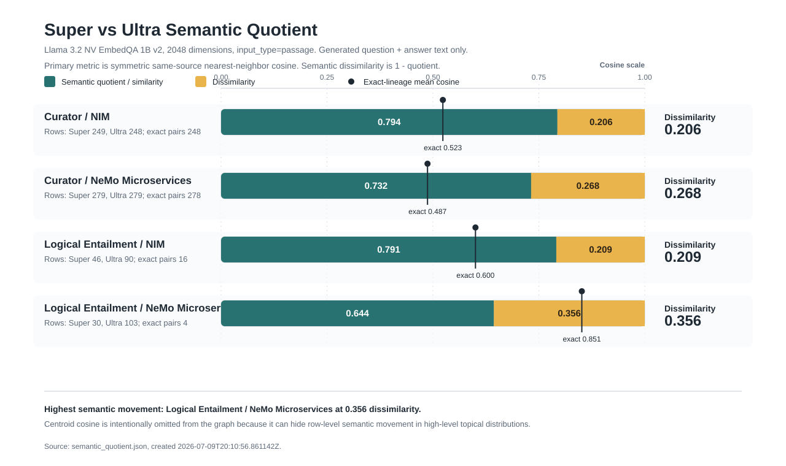

# Super vs Ultra Semantic Quotient

Created: 2026-07-09T20:10:56.861142Z

Embedding model: `nvidia/llama-3.2-nv-embedqa-1b-v2` via `http://10.43.101.173:8000/v1/embeddings` with `input_type=passage`.

Primary quotient: symmetric same-source nearest-neighbor cosine between Super and Ultra QA rows. `1 - quotient` is the semantic dissimilarity score. Text embedded is generated question plus answer only; source context is excluded.

| Approach | Corpus | Super rows | Ultra rows | Exact pairs | Exact-pair mean | Source-NN quotient | Dissimilarity | Centroid cosine |
| --- | --- | ---: | ---: | ---: | ---: | ---: | ---: | ---: |
| Curator | NIM | 249 | 248 | 248 | 0.523447 | 0.793715 | 0.206285 | 0.993617 |
| Curator | NeMo Microservices | 279 | 279 | 278 | 0.487266 | 0.731717 | 0.268283 | 0.991445 |
| LE | NIM | 46 | 90 | 16 | 0.600498 | 0.791224 | 0.208776 | 0.855108 |
| LE | NeMo Microservices | 30 | 103 | 4 | 0.851467 | 0.643855 | 0.356145 | 0.574293 |

## Interpretation

- Curator / NIM: quotient 0.794, dissimilarity 0.206; exact-pair mean 0.523447.
- Curator / NeMo Microservices: quotient 0.732, dissimilarity 0.268; exact-pair mean 0.487266.
- LE / NIM: quotient 0.791, dissimilarity 0.209; exact-pair mean 0.600498.
- LE / NeMo Microservices: quotient 0.644, dissimilarity 0.356; exact-pair mean 0.851467.

Lower quotient means Ultra is adding more semantically different QA coverage relative to Super; higher quotient means outputs are closer paraphrases or repeated coverage of the same concepts.
