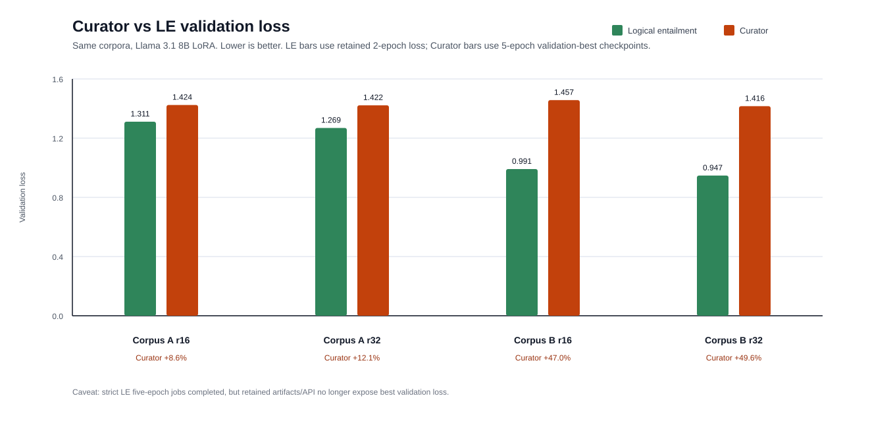
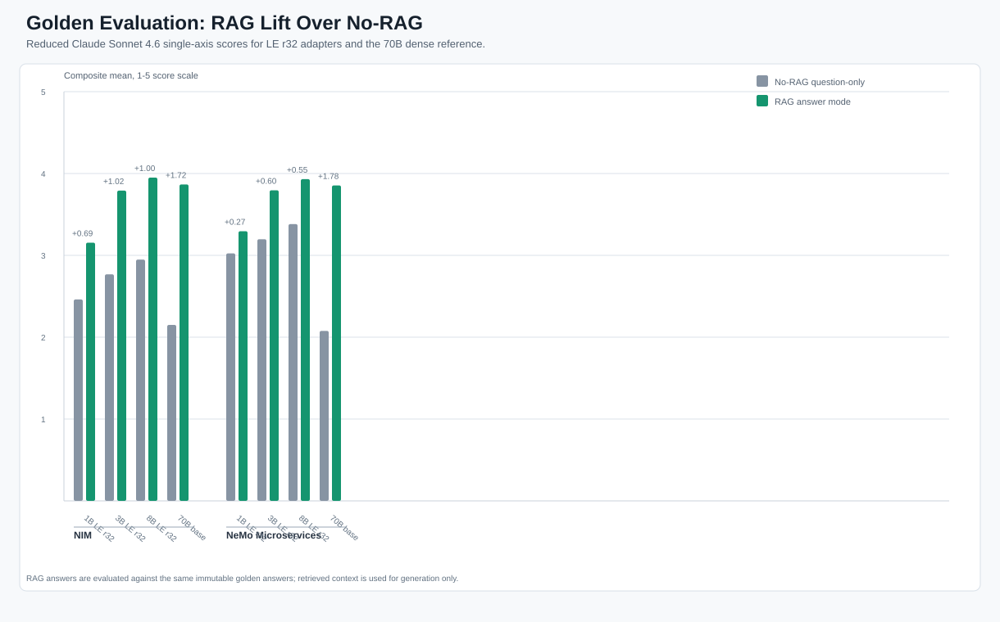
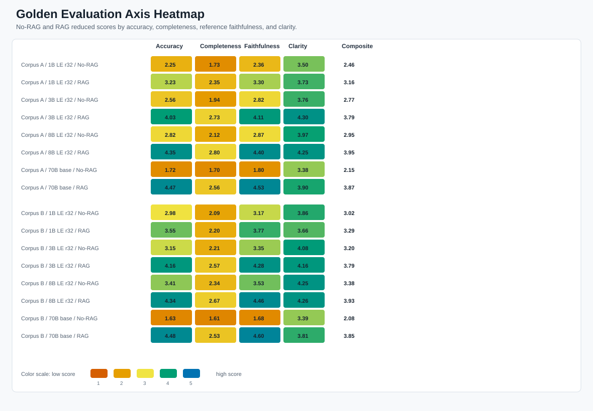
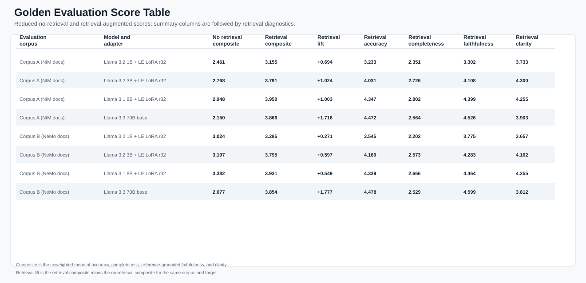
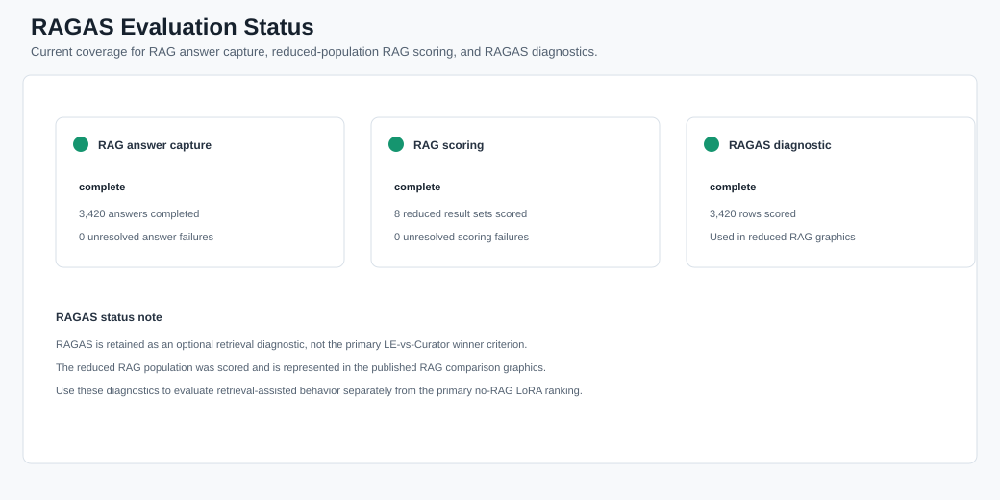

# Evaluation Results

This page keeps the public repo focused on the final, reusable workflow while still showing the case-study outcome that motivated the implementation. Raw logs, JSONL corpora, Customizer run directories, evaluator traces, and local manifests are intentionally excluded from the public branch.

## What Was Compared

The case study used two representative public technical-documentation corpora to compare two dataset-generation strategies for LoRA SFT. In the retained charts, Corpus A is the NIM documentation slice and Corpus B is the NeMo Microservices documentation slice. They are representative corpora, not the conceptual target of the repo:

- Logical Entailment (LE): premise/conclusion extraction followed by grounded QA/KVP generation.
- Curator DiverseQA: NeMo Curator synthetic QA generation over the same corpus scope.

Adapters were trained over dense Llama 1B, 3B, and 8B bases with LoRA ranks r16 and r32. A dense Llama 3.3 70B Instruct target was used as a reference comparison target, not as the judge. The formal no-RAG scoring judged saved model answers against an immutable golden QA set so that retrieval quality did not mask model/adapter behavior.

## Validation-Loss Signal

The retained validation-loss evidence favored the LE dataset path over Curator DiverseQA across the matched 8B comparison slices. Lower is better. The corpus labels identify representative public examples only.

| Corpus | Rank | LE val loss | Curator best val loss | Curator minus LE |
|---|---:|---:|---:|---:|
| Corpus A | r16 | 1.311 | 1.424 | +8.6% |
| Corpus A | r32 | 1.269 | 1.422 | +12.1% |
| Corpus B | r16 | 0.991 | 1.457 | +47.0% |
| Corpus B | r32 | 0.947 | 1.416 | +49.6% |

Caveat: the LE values are from the available two-epoch loss-bearing records, while the Curator values are five-epoch best checkpoints. This is therefore a practical retained-evidence comparison, not a perfectly epoch-matched benchmark.

## Golden Evaluation Methodology

The golden test set was built from prior held-out QA rows rather than current validation splits. The construction process removed exact normalized prompt overlaps with active train/validation files, retained source provenance, and emitted deterministic row identifiers plus checksums. For the primary model-quality test, answers were collected without RAG or injected context.

The no-RAG single-axis evaluation used four 1-5 axes: accuracy, completeness, reference-grounded faithfulness, and clarity. A separate independent judge scored saved responses only against the question, immutable reference answer, and model answer. The reduced RAG follow-up used the same winner population and judged saved RAG answers against the same immutable reference answers.

## Reduced Winner Population

The completed single-axis pass selected the LE r32 adapters for the reduced follow-up population across the 1B, 3B, and 8B dense bases. The table below shows composite means on the 1-5 scale for the reduced no-RAG and RAG evaluations.

| Corpus | Target | No-RAG composite | RAG composite | Rows |
|---|---|---:|---:|---:|
| Corpus A | 1B LE r32 | 2.461 | 3.155 | 424 |
| Corpus A | 3B LE r32 | 2.768 | 3.791 | 424 |
| Corpus A | 8B LE r32 | 2.948 | 3.950 | 424 |
| Corpus A | Llama 3.3 70B base | 2.150 | 3.866 | 424 |
| Corpus B | 1B LE r32 | 3.024 | 3.295 | 431 |
| Corpus B | 3B LE r32 | 3.197 | 3.795 | 431 |
| Corpus B | 8B LE r32 | 3.382 | 3.931 | 431 |
| Corpus B | Llama 3.3 70B base | 2.077 | 3.854 | 431 |

## Interpretation

The result supports the repo thesis: for small, domain-specific corpora, a provenance-preserving LE extraction path can produce high-utility SFT data for smaller dense LoRA adapters. The point is the repeatable NVAIE-centered representation, not the identity of the example documentation. The 8B LE r32 adapters were the strongest reduced-population LoRA targets in both corpora, and the 3B LE r32 adapters were close enough to be operationally relevant when serving cost or GPU footprint matters.

RAG improved all reduced targets in this retained case study, which is expected: retrieval supplies source-grounded context at answer time. This should be read as a workload-specific result, not as a claim that either LoRA-only or RAG-assisted serving is universally preferable. The no-RAG result is the cleaner measure of what the LoRA adapter itself learned; the RAG result shows the operational upside of pairing that domain-adapted model with retrieved context when freshness, citations, or auditability matter.

## RAGAS Status

RAGAS is retained as an optional retrieval diagnostic. It is not the primary LoRA winner criterion. The public case-study artifact records RAGAS coverage/status rather than a completed reduced-population RAGAS score, because the retained smoke run reached NeMo Evaluator but did not score without a configured judge embedding model.

